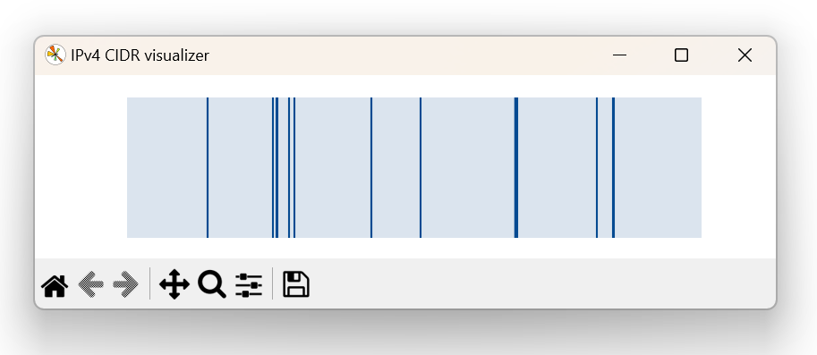
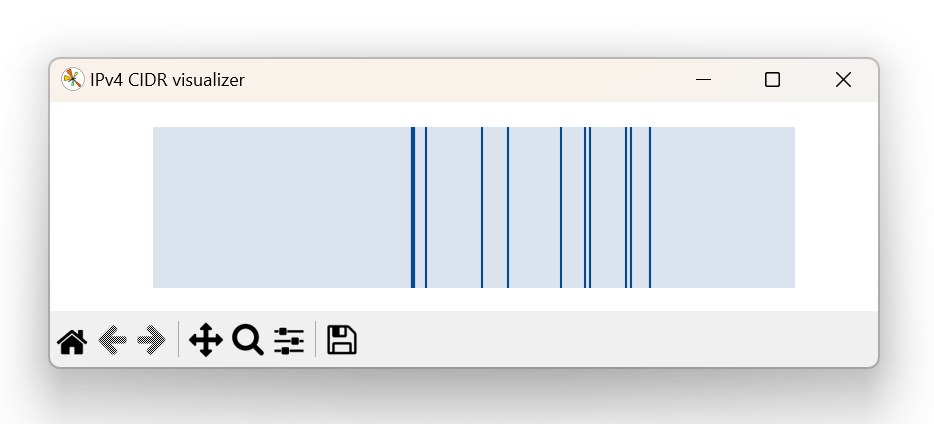
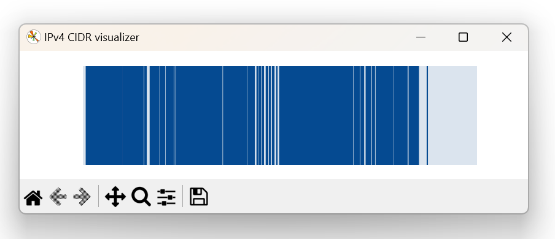
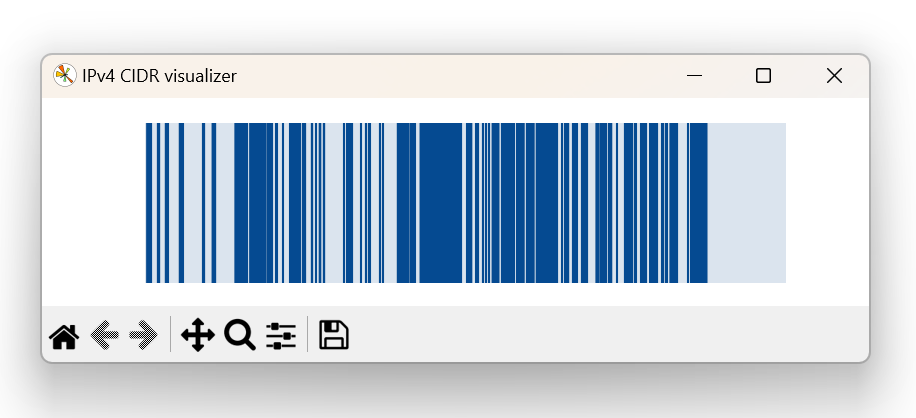

# IPv4 CIDR visualizer

A simple Python script to visualize IPv4 CIDR ranges with a colored bar.

## Usage

Prepare a text file with one CIDR range per line, e.g.:

```text
1.0.0.0/8
2.0.0.0/8
3.0.0.0/8
```

Run the script:

```bash
python main.py <input_file>
```

## Examples

### Google



### Cloudflare



### United States



### China


